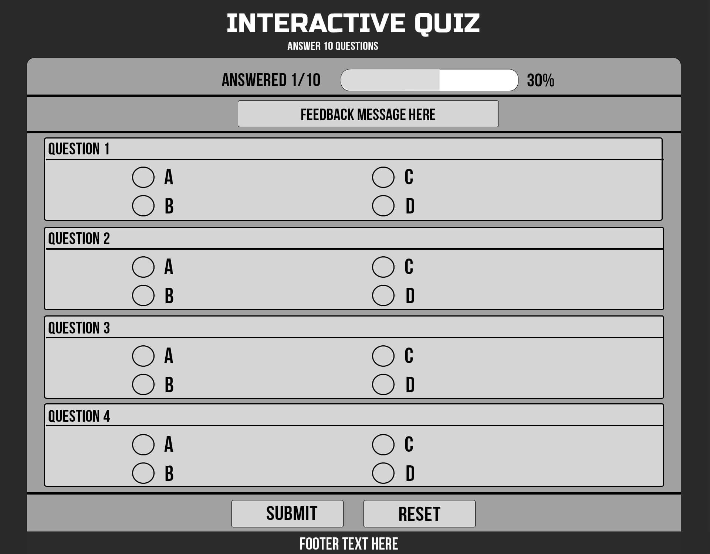
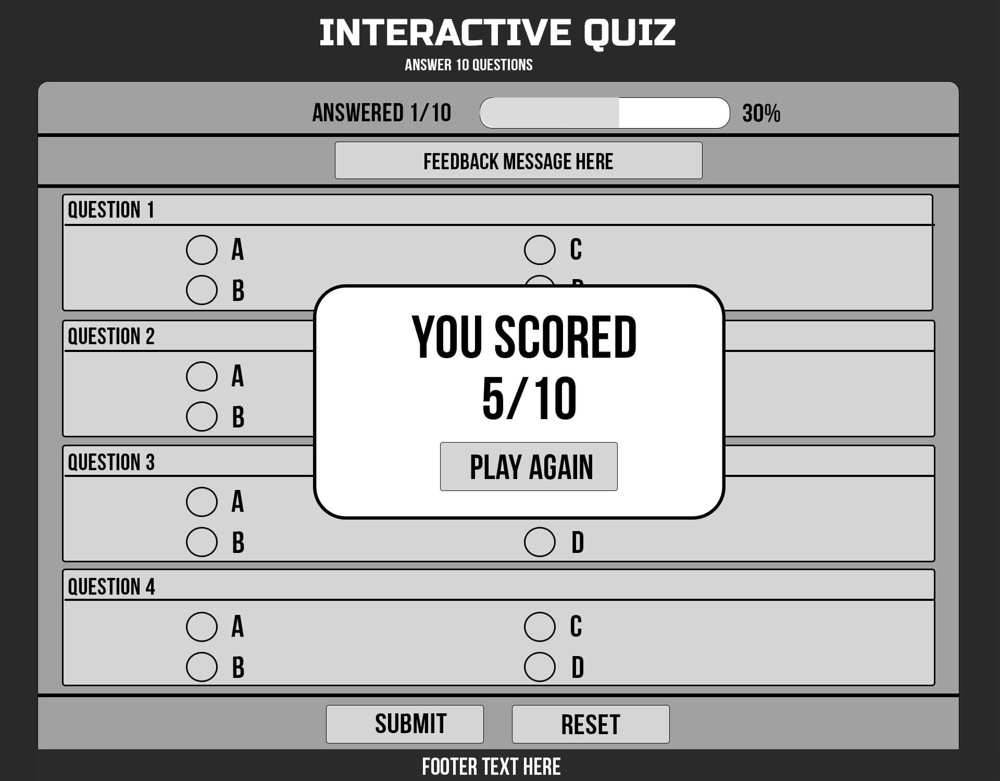
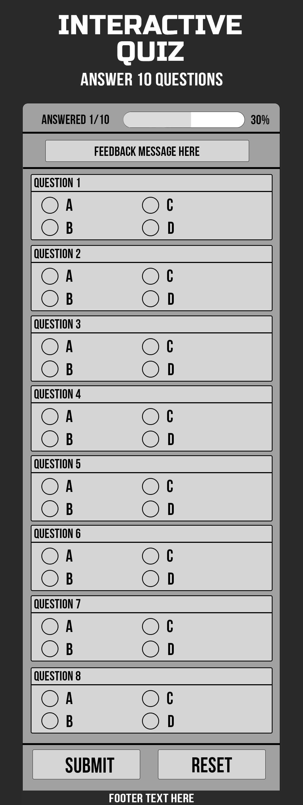
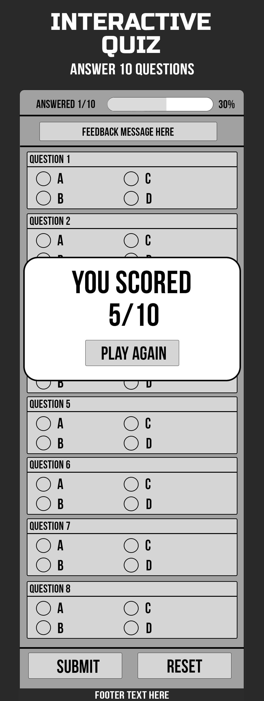
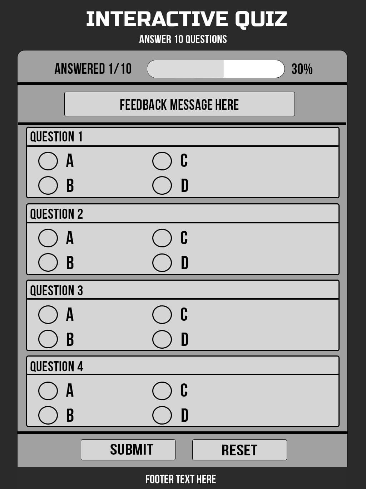

# Project Title
**Interactive Quiz - General Knowledge**

## Project Description
The Interactive Quiz is a single-page web project that lets users answer 10 general knowledge multiple-choice questions, track their progress as they go, and submit to receive a final schore. The project demonstrates core HTML, CSS and JavaScript concepts, including form handling, input validation, event listeners, and dynamic DOM elements.  

## Features

#### Feature 1 - 10-question quiz form
Users answer 10 general knowledge questions using radio button inputs. The quiz is designed as a single-page experience with consistent question formatting and clear layout.

#### Feature 2 - Progress tracking: answered count + progress bar
As the users selects answers, JavaScript updates and **Answered x/10** counter and **progress bar** that fills based on the number of questions completed. This provides instant feedback and helps users see how far through the quiz they are

#### Feature 3 - Validation + score feedback
On **Submit**, JavaScript checks that all questions have been answered. If any are missing, a message appears telling the user qhich question to complete. Once complete, the quiz calculates the final score and displays it in a modal dialog. A **Reset** button clears selections, resets the progress bar, removes feedback, and returns the quiz to its starting state.

## Design choices

#### Colors
A clean, modern colour scheme was chosen to keep the quiz easy to read and reduce visual clutter. The dark page background creates contrast, the light card background improves readability.

#### Fonts/Typography
A system font stack is used to ensure fast loading, with no external font requests, consistent readability across devices, and a simple modern appearence suitable for a quiz interface.

#### Images/Graphics
The progress bar is used as the main graphical element and is updated dynamically with JavaScript to show quiz completion. A favicon (Quiz1.jpg) is used for basic branding and browser tab identification.

## Development Process

#### Project planning
Initial scop included a 10-question quiz, radio-button answers (one selection per question), submit and reset controls, progress tracking (answered count + progress bar), and validation to prevent incomplete submission, as well as returning score, highlighting correct/incorrect answers and form reset on submit.

#### Wireframes
#### Desktop

#### Desktop with score

#### Mobile

#### Mobile with score

#### Ipad

#### Ipad with score

#### Challenges Faced
- **Sticky progress UI:** I had orginally considered having each question revealed in sequence as the user clicks through, but on initial testing, this overcomplicated what I had envisioned as a simple-as-possible user experience. To keep as much information viewable to the user as possible, I revised the design so that progress indicators remained visible during scrolling required a sticky status section and testing across screen sizes. 
- **Validation feedback behaviour:** The feedback message needed to be informative without affecting layout when unused as I found that leaving the text area blank until text appears messed with the proportions of the layout's appearance.I resolved this in javascript bu toggling visibility only when validation fails/succeeds. 
- **Keeping selectors and event listeners stable during iterations:** As HTML structor evolved, selectors and event logic needed to be updated to match. Testing and console debugging were used to identify broken references and ensure events fired correctly.
- **Refactoring duplicated logic:** Multiple reset triggers initially had separate implementations, which caused redundancy and console errors. This was resolved by consolodating reset behaviour into a single function used by both the reset button and the dialog close event.

#### Interactivity
JavaScript is used to add interactivity through event listeners and DOM manipulation.`change` events update the answered count and progress bar. The `submit` event validates that all questions are answered and then calculates the score. The score is displayed using a modal dialog. Reset behaviour is handled through a shared reset function. DOM manipulation is used to update text, update the progress bar width, show/hid messages, and apply/remove visual feedback styles. 

## Deployed site

This site has been deployed to GitHub Pages at the URL below:

[Githhub Pages](https://github.com/ScriptusDigital/ScriptumDigital_JavaScript_Assignment_Quiz)

and is live via:

[Live Page](https://scriptusdigital.github.io/ScriptumDigital_JavaScript_Assignment_Quiz/)
